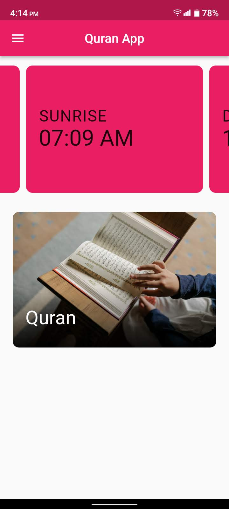
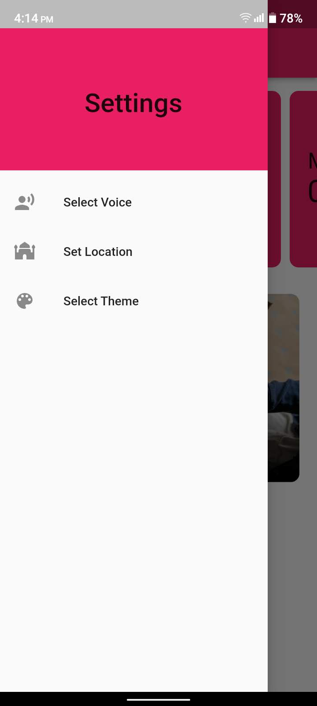
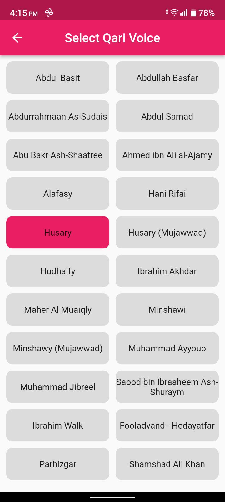
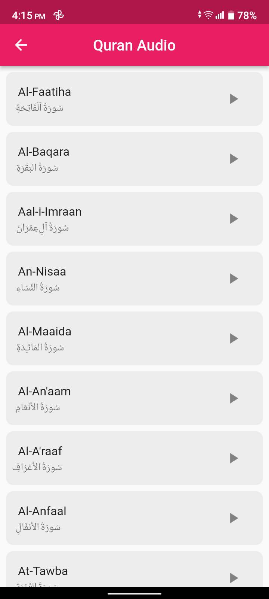
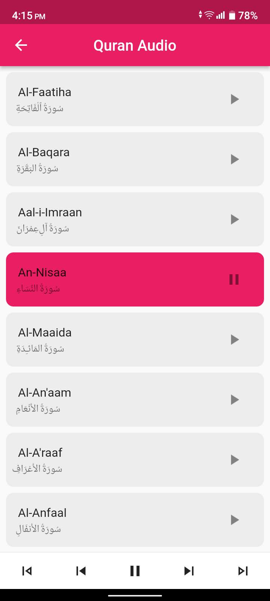

# Flutter Quran App

This app is built with Flutter. It is a simple app that shows todays prayer times and can be used to play Quran recitations.
All of the data used in this app comes from public API's.

## Possible Feature Upgrades

- [ ] Notification for prayer times
- [ ] Location select for prayer times
- [x] Store fetched surah's list locally
- [ ] Download surah's audio
- [ ] Media control from notification bar
- [ ] Add surah's to favorites
- [x] Pick Ka'ri Voice

## Screenshots

## Releases

`pubspec.yaml` uses the format `version: MAJOR.MINOR.PATCH+BUILD`. Example: `version: 1.7.0+7`

Rules:

- `MAJOR.MINOR.PATCH` is the human-readable version shown in the app and on F-Droid.
- `BUILD` (the number after `+`) is the `versionCode` in Android — it must increment by exactly 1 with every release. It must never decrease.
- To release a new version:
  1. Increment `MAJOR.MINOR.PATCH` per semantic versioning.
  2. Increment the build number by 1.
  3. Commit with message: `chore: bump version to 1.7.0+7`
  4. Tag: `git tag v1.7.0 && git push origin v1.7.0`
