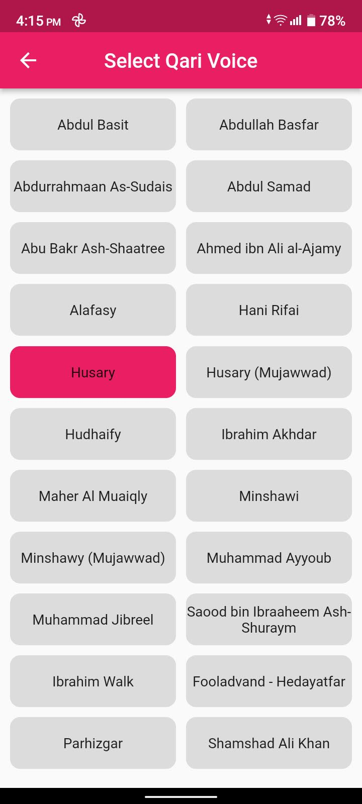

# Flutter Quran App

This app is built with Flutter. It is a simple app that shows todays prayer times and can be used to play Quran recitations.

All of the data used in this app comes from public API's.

## Possible Feature Upgrades

- [ ] Notification for prayer times
- [ ] Location select for prayer times
- [x] Store fetched surah's list locally
- [ ] Download surah's audio
- [ ] Media control from notification bar
- [ ] Add surah's to favorites
- [x] Pick Ka'ri Voice

## Screenshots

